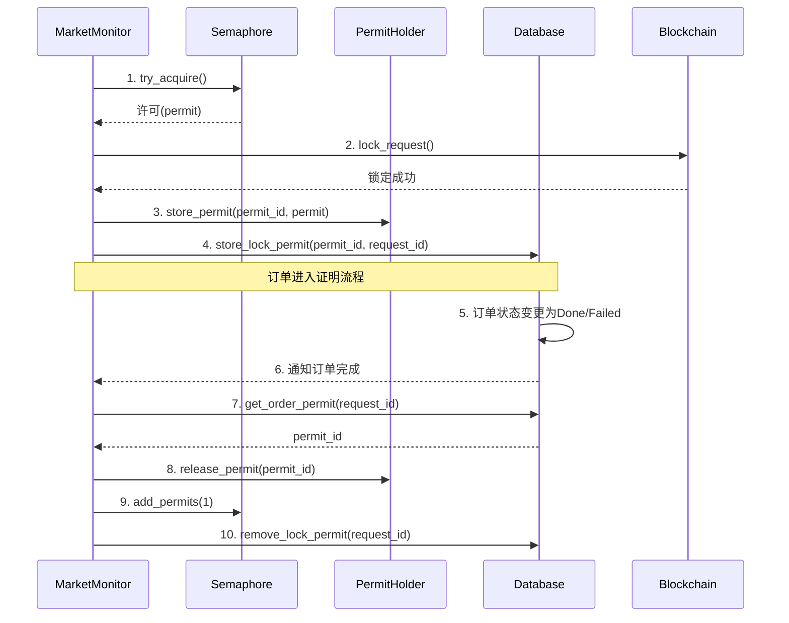

# 订单快速锁定方案

## 方案概述

该方案实现"扫描即锁定"功能，绕过常规订单处理流程中的多个中间环节，最大限度减少锁定延迟。同时引入资源管控，限制最多同时锁定3个订单，防止过度消耗资源。

## 修改文件和方法

### 1. `crates/broker/src/config.rs`

添加快速锁定相关配置项：

```rust
pub struct MarketConf {
    // ... 现有字段 ...
    
    /// 是否启用快速锁定模式
    ///
    /// 启用后，发现订单将尝试立即锁定，绕过预执行和常规处理流程
    #[serde(default)]
    pub fast_lock_enabled: bool,
    
    /// 快速锁定并发限制
    ///
    /// 最大同时进行的锁定操作数量，默认为3
    #[serde(default = "defaults::fast_lock_concurrency")]
    pub fast_lock_concurrency: u32,
}

// 在defaults模块中添加
pub const fn fast_lock_concurrency() -> u32 {
    3
}

impl Default for MarketConf {
    fn default() -> Self {
        Self {
            // ... 现有字段默认值 ...
            fast_lock_enabled: false,
            fast_lock_concurrency: defaults::fast_lock_concurrency(),
        }
    }
}
```

### 2. `crates/broker/src/market_monitor.rs`

#### a) 修改 `MarketMonitor` 结构体

```rust
pub struct MarketMonitor<P> {
    // ... 现有字段 ...
    active_locks: Arc<tokio::sync::Semaphore>,  // 控制并发锁定数量的信号量
    fast_lock_enabled: bool,                    // 是否启用快速锁定
}
```

#### b) 修改 `new` 构造函数

```rust
pub fn new(
    lookback_blocks: u64,
    market_addr: Address,
    provider: Arc<P>,
    db: DbObj,
    chain_monitor: Arc<ChainMonitorService<P>>,
    prover_addr: Address,
    order_stream: Option<OrderStreamClient>,
    new_order_tx: tokio::sync::mpsc::Sender<Box<OrderRequest>>,
    fulfillment_tx: tokio::sync::broadcast::Sender<U256>,
    config: ConfigLock,                        // 添加配置参数
) -> Self {
    // 读取配置
    let config_guard = config.lock_all().unwrap_or_else(|_| {
        panic!("Failed to lock config")
    });
    
    let fast_lock_enabled = config_guard.market.fast_lock_enabled;
    let fast_lock_concurrency = config_guard.market.fast_lock_concurrency as usize;
    
    Self {
        lookback_blocks,
        market_addr,
        provider,
        db,
        chain_monitor,
        prover_addr,
        order_stream,
        new_order_tx,
        fulfillment_tx,
        active_locks: Arc::new(tokio::sync::Semaphore::new(fast_lock_concurrency)),
        fast_lock_enabled,
    }
}
```

#### c) 添加 `try_fast_lock` 方法

```rust
/// 尝试快速锁定订单
async fn try_fast_lock(
    &self,
    request_id: U256,
    expires_at: u64,
) -> Result<bool> {
    // 如果未启用快速锁定，直接返回
    if !self.fast_lock_enabled {
        return Ok(false);
    }
    
    // 尝试获取锁定许可
    match self.active_locks.try_acquire() {
        Ok(permit) => {
            tracing::info!("尝试快速锁定订单: 0x{:x}", request_id);
            
            let market = BoundlessMarketService::new(
                self.market_addr, 
                self.provider.clone(), 
                self.prover_addr
            );
            
            // 创建锁定任务，并将permit移入其中
            let provider = self.provider.clone();
            let db = self.db.clone();
            let market_addr = self.market_addr;
            let prover_addr = self.prover_addr;
            let chain_id = market.chain_id().await?;
            
            let lock_task = tokio::spawn(async move {
                // 获取订单详情
                if let Ok((proof_request, signature)) = market.get_submitted_request(request_id, Some(expires_at)).await {
                    // 执行锁定操作
                    match market.lock_request(request_id, None).await {
                        Ok(tx_hash) => {
                            tracing::info!("订单锁定交易已提交: 0x{:x}, 交易哈希: {}", request_id, tx_hash);
                            
                            // 等待交易确认，设置30秒超时
                            match tokio::time::timeout(
                                Duration::from_secs(30), 
                                provider.get_transaction_receipt(tx_hash)
                            ).await {
                                Ok(Ok(Some(receipt))) if receipt.status.unwrap_or(0.into()) == 1.into() => {
                                    tracing::info!("订单快速锁定成功: 0x{:x}", request_id);
                                    
                                    // 创建订单对象
                                    let order = OrderRequest::new(
                                        proof_request,
                                        signature,
                                        FulfillmentType::LockAndFulfill,
                                        market_addr,
                                        chain_id,
                                    );
                                    
                                    // 更新数据库
                                    if let Err(e) = db.insert_accepted_request(&order, U256::ZERO).await {
                                        tracing::error!("更新订单状态失败: 0x{:x}, 错误: {:?}", request_id, e);
                                    }
                                    
                                    return true;
                                },
                                _ => {
                                    tracing::warn!("订单锁定交易失败或超时: 0x{:x}", request_id);
                                }
                            }
                        },
                        Err(e) => {
                            tracing::warn!("订单锁定失败: 0x{:x}, 错误: {:?}", request_id, e);
                        }
                    }
                }
                
                false
            });
            
            // 不等待任务完成，但记录结果到日志
            tokio::spawn(async move {
                match lock_task.await {
                    Ok(true) => { /* 锁定成功，无需额外操作 */ },
                    Ok(false) => tracing::info!("订单 0x{:x} 快速锁定处理完成，但未成功锁定", request_id),
                    Err(e) => tracing::error!("订单 0x{:x} 快速锁定任务失败: {:?}", request_id, e),
                }
                // permit在这里被自动释放
            });
            
            Ok(true) // 表示已尝试快速锁定
        },
        Err(_) => {
            tracing::info!(
                "达到最大并发锁定限制({}个)，订单 0x{:x} 将通过常规流程处理", 
                self.active_locks.available_permits(),
                request_id
            );
            Ok(false) // 未尝试快速锁定
        }
    }
}
```

#### d) 修改 `process_event` 方法

```rust
async fn process_event(
    &self,
    event: IBoundlessMarket::RequestSubmitted,
    provider: Arc<P>,
    market_addr: Address,
    chain_id: u64,
    new_order_tx: &tokio::sync::mpsc::Sender<Box<OrderRequest>>,
) -> Result<()> {
    let request_id = U256::from(event.requestId);
    let expires_at = event.request.expires_at();
    
    // 快速检查订单状态
    let market = BoundlessMarketService::new(market_addr, provider.clone(), self.prover_addr);
    
    match market.get_status(request_id, Some(expires_at)).await {
        Ok(RequestStatus::Bidding) => {
            // 尝试快速锁定
            let fast_locked = self.try_fast_lock(request_id, expires_at).await?;
            
            // 如果未能快速锁定，按常规流程处理
            if !fast_locked {
                // 原有的处理逻辑
                if let Ok((proof_request, signature)) = market.get_submitted_request(request_id, Some(expires_at)).await {
                    let order = OrderRequest::new(
                        proof_request,
                        signature,
                        FulfillmentType::LockAndFulfill,
                        market_addr,
                        chain_id,
                    );
                    
                    // 发送到常规处理队列
                    if let Err(e) = new_order_tx.send(Box::new(order)).await {
                        tracing::error!("Failed to send new order: 0x{:x}, error: {}", request_id, e);
                        return Err(anyhow::anyhow!("Failed to send new order"));
                    }
                }
            }
        },
        Ok(status) => {
            tracing::debug!("Skipping request 0x{:x} reason: status is {:?}", request_id, status);
        },
        Err(e) => {
            tracing::warn!("Failed to get request status: 0x{:x}, error: {:?}", request_id, e);
        }
    }
    
    Ok(())
}
```

#### e) 修改 `find_open_orders` 方法，添加快速锁定功能

```rust
async fn find_open_orders(
    &self,
    lookback_blocks: u64,
    market_addr: Address,
    provider: Arc<P>,
    chain_monitor: Arc<ChainMonitorService<P>>,
    new_order_tx: &tokio::sync::mpsc::Sender<Box<OrderRequest>>,
) -> Result<u64, MarketMonitorErr> {
    // ... 现有代码 ...
    
    let mut order_count = 0;
    for log in decoded_logs {
        let event = &log.inner.data;
        let request_id = U256::from(event.requestId);
        let expires_at = event.request.expires_at();

        let req_status = match market.get_status(request_id, Some(expires_at)).await {
            Ok(val) => val,
            Err(err) => {
                tracing::warn!("Failed to get request status: {err:?}");
                continue;
            }
        };

        if matches!(req_status, RequestStatus::Bidding) {
            // 添加快速锁定逻辑
            if self.fast_lock_enabled {
                match self.try_fast_lock(request_id, expires_at).await {
                    Ok(true) => {
                        order_count += 1;
                        continue; // 已尝试快速锁定，跳过常规处理
                    },
                    Ok(false) => {
                        // 未能快速锁定，继续常规处理
                    },
                    Err(e) => {
                        tracing::warn!("快速锁定过程出错: {:?}", e);
                        // 继续常规处理
                    }
                }
            }
            
            // 常规订单处理逻辑...
            // ... 现有代码 ...
            
            order_count += 1;
        }
    }
    
    // ... 现有代码 ...
}
```

### 3. `crates/broker/src/lib.rs`

修改 `Broker` 结构体的 `start_service` 方法，传递配置到 `MarketMonitor`：

```rust
pub async fn start_service(&self) -> Result<()> {
    // ... 现有代码 ...
    
    // 创建MarketMonitor时传递配置
    let market_monitor = MarketMonitor::new(
        self.config_watcher.config.lock_all()?.market.lookback_blocks,
        deployment.boundless_market_address,
        self.provider.clone(),
        self.db.clone(),
        chain_monitor.clone(),
        deployment.prover_address,
        order_stream,
        new_order_tx.clone(),
        fulfillment_tx,
        self.config_watcher.config.clone(), // 传递配置
    );
    
    // ... 现有代码 ...
}
```

### 4. `broker.toml` 文件

在配置文件中添加新的配置项：

```toml
[market]
# ... 现有配置 ...

# 快速锁定配置
fast_lock_enabled = true              # 是否启用快速锁定模式
fast_lock_concurrency = 3             # 最大并发锁定数，默认为3

# ... 其他配置 ...
```

## 实施步骤

1. 修改 `config.rs`，添加快速锁定相关的配置项
2. 修改 `market_monitor.rs`，添加快速锁定功能
3. 调整 `lib.rs` 中创建 `MarketMonitor` 的代码
4. 在 `broker.toml` 中添加快速锁定配置
5. 重新编译并启动服务

## 预期效果

1. **高效锁定**：发现订单后立即尝试锁定，跳过中间环节
2. **资源控制**：最多同时进行3个锁定操作，防止资源过度消耗
3. **优雅降级**：超出并发限制的订单自动进入常规处理流程
4. **配置灵活**：可通过配置文件开关快速锁定功能和调整并发数

该方案同时兼顾了锁定速度和资源管理，在竞争环境中提供更好的表现。

## 并发许可管理优化

原方案中的一个关键问题是：快速锁定操作获取的并发许可(`permit`)在锁定成功后就立即被释放，而不是跟踪整个订单的生命周期。这会导致并发限制失效，因为它只限制了同时进行的锁定操作数量，而不是同时处理的订单总数。

### 优化方案

添加对订单全生命周期的许可管理，确保从锁定到最终完成都占用一个并发槽位。

#### 1. 创建许可持有器（`crates/broker/src/permit_holder.rs`）

```rust
use std::collections::HashMap;
use std::sync::{Arc, Mutex};
use tokio::sync::Semaphore;

pub struct GlobalPermitHolder {
    permits: Mutex<HashMap<String, OwnedPermit>>,
}

struct OwnedPermit {
    _permit: tokio::sync::OwnedSemaphorePermit,
}

impl GlobalPermitHolder {
    pub fn new() -> Self {
        Self {
            permits: Mutex::new(HashMap::new()),
        }
    }
    
    pub fn store_permit(&self, id: String, permit: tokio::sync::SemaphorePermit<'_>) {
        let owned_permit = permit.forget();
        let mut permits = self.permits.lock().unwrap();
        permits.insert(id, OwnedPermit { _permit: owned_permit });
    }
    
    pub fn release_permit(&self, id: &str) -> bool {
        let mut permits = self.permits.lock().unwrap();
        permits.remove(id).is_some()
    }
}

lazy_static::lazy_static! {
    pub static ref GLOBAL_PERMIT_HOLDER: GlobalPermitHolder = GlobalPermitHolder::new();
}
```

#### 2. 修改数据库方法添加许可关联（`crates/broker/src/db.rs`）

```rust
// 添加新的方法和表结构
impl DbObj {
    // 存储订单许可关联
    pub async fn store_lock_permit(&self, permit_id: String, request_id: U256) -> Result<()> {
        sqlx::query!(
            "INSERT INTO order_permits (permit_id, request_id) VALUES (?, ?)",
            permit_id,
            request_id.to_string(),
        )
        .execute(&self.pool)
        .await
        .context("Failed to store order permit")?;
        
        Ok(())
    }
    
    // 获取订单关联的许可ID
    pub async fn get_order_permit(&self, request_id: U256) -> Result<Option<String>> {
        let record = sqlx::query!(
            "SELECT permit_id FROM order_permits WHERE request_id = ?",
            request_id.to_string(),
        )
        .fetch_optional(&self.pool)
        .await
        .context("Failed to query order permit")?;
        
        Ok(record.map(|r| r.permit_id))
    }
    
    // 删除订单许可关联
    pub async fn remove_lock_permit(&self, request_id: U256) -> Result<()> {
        sqlx::query!(
            "DELETE FROM order_permits WHERE request_id = ?",
            request_id.to_string(),
        )
        .execute(&self.pool)
        .await
        .context("Failed to remove order permit")?;
        
        Ok(())
    }
}
```

#### 3. 修改 `try_fast_lock` 方法存储许可

```rust
/// 尝试快速锁定订单
async fn try_fast_lock(
    &self,
    request_id: U256,
    expires_at: u64,
) -> Result<bool> {
    // ... 现有代码 ...
    
    match self.active_locks.try_acquire() {
        Ok(permit) => {
            // ... 现有代码 ...
            
            // 修改锁定任务
            let active_locks = self.active_locks.clone();
            let lock_task = tokio::spawn(async move {
                // ... 现有代码 ...
                
                // 修改返回值，提供更多信息
                match market.lock_request(request_id, None).await {
                    // ... 其他代码 ...
                    
                    Ok(tx_hash) => {
                        // ... 其他代码 ...
                        
                        // 锁定成功，保存并维护许可
                        if /* 锁定成功 */ {
                            // 创建唯一的许可ID
                            let permit_id = format!("permit_{}", request_id);
                            
                            // 将许可存入全局持有器
                            GLOBAL_PERMIT_HOLDER.store_permit(permit_id.clone(), permit);
                            
                            // 记录许可与订单的关联
                            if let Err(e) = db.store_lock_permit(permit_id, request_id).await {
                                tracing::error!("存储订单许可关联失败: {:?}", e);
                            }
                            
                            return (true, None); // 锁定成功，许可已保存
                        }
                        
                        // 锁定失败，返回许可以释放
                        return (false, Some(permit));
                    }
                    
                    Err(_) => {
                        return (false, Some(permit)); // 错误发生，返回许可以释放
                    }
                }
            });
            
            // 修改任务完成处理
            tokio::spawn(async move {
                match lock_task.await {
                    Ok((success, maybe_permit)) => {
                        if !success {
                            if let Some(p) = maybe_permit {
                                // 锁定失败，释放许可
                                drop(p);
                            }
                            tracing::info!("订单 0x{:x} 快速锁定失败，已释放许可", request_id);
                        } else {
                            tracing::info!("订单 0x{:x} 快速锁定成功，许可将持有至订单完成", request_id);
                        }
                    },
                    Err(e) => {
                        // 任务执行出错，释放许可
                        tracing::error!("订单 0x{:x} 快速锁定任务失败: {:?}", request_id, e);
                        drop(permit);
                    }
                }
            });
            
            Ok(true)
        },
        // ... 现有代码 ...
    }
}
```

#### 4. 添加订单状态变更监听器

```rust
impl<P> MarketMonitor<P> where P: Provider<Ethereum> + 'static + Clone {
    // 在start_monitor方法中添加
    pub async fn start_monitor(mut self, cancel_token: CancellationToken) -> Result<(), MarketMonitorErr> {
        // ... 现有代码 ...
        
        // 启动订单完成监听器
        self.setup_order_completion_listener();
        
        // ... 现有代码 ...
    }
    
    // 添加新方法
    fn setup_order_completion_listener(&self) {
        let db = self.db.clone();
        let active_locks = self.active_locks.clone();
        
        // 创建通道用于接收订单状态变更通知
        let (tx, mut rx) = tokio::sync::mpsc::channel(100);
        
        // 启动数据库监听线程
        tokio::spawn(async move {
            // 此处应实现监听数据库中订单状态变更的逻辑
            // 简化示例：周期性检查数据库中的已完成订单
            let mut interval = tokio::time::interval(std::time::Duration::from_secs(10));
            
            loop {
                interval.tick().await;
                
                // 查询最近完成的订单
                if let Ok(completed_orders) = db.get_recently_completed_orders().await {
                    for order in completed_orders {
                        let _ = tx.send(order).await;
                    }
                }
            }
        });
        
        // 启动许可释放处理线程
        tokio::spawn(async move {
            while let Some(order) = rx.recv().await {
                // 检查订单是否有关联的许可
                if let Ok(Some(permit_id)) = db.get_order_permit(order.request_id).await {
                    tracing::info!(
                        "订单 0x{:x} 已完成处理(状态:{:?})，释放快速锁定许可",
                        order.request_id,
                        order.status
                    );
                    
                    // 释放许可
                    if GLOBAL_PERMIT_HOLDER.release_permit(&permit_id) {
                        // 增加信号量值，恢复一个可用许可
                        active_locks.add_permits(1);
                        tracing::info!("许可已释放，当前可用许可: {}", active_locks.available_permits());
                    }
                    
                    // 清理数据库中的许可记录
                    let _ = db.remove_lock_permit(order.request_id).await;
                }
            }
        });
    }
}
```

### 许可生命周期管理流程图



### 优化效果

1. **准确的资源控制**：限制的是同时处理的订单总数，而不只是同时锁定的操作
2. **完整的生命周期管理**：从锁定开始直到订单完成或失败都占用一个并发槽位
3. **精确的许可释放**：只有当订单完全处理完成后才释放许可
4. **异常处理**：即使在出错情况下也能正确释放许可

这个优化确保了快速锁定方案能够精确控制系统资源，避免过度承诺，同时保持高效的订单处理能力。 